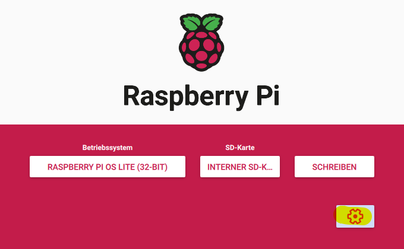
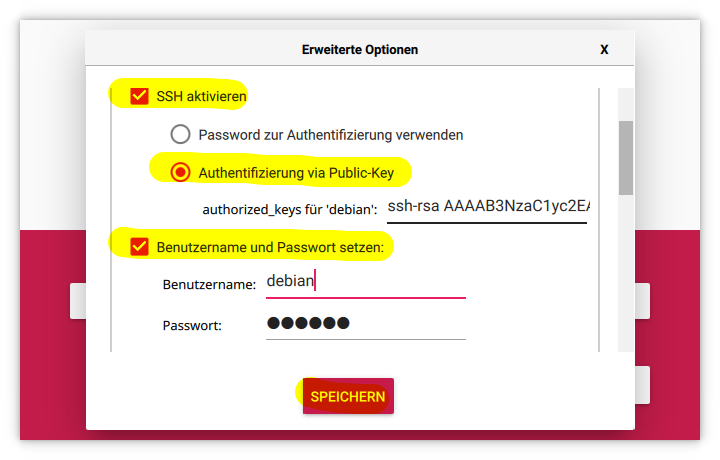
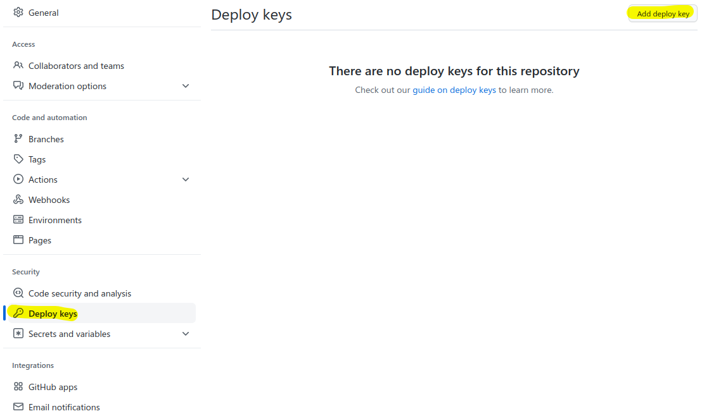
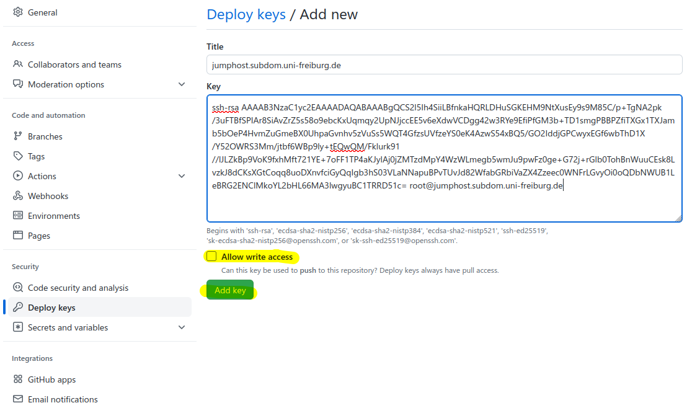

# Installing a Jumphost

This guide is for AlmaLinux, RockyLinux, CentOS Stream, Ubuntu and Debain. The roles were tested with RockyLinux 8 and 9, Ubuntu 22.04 and Debain 11. We recommend using Alma- or RockyLinux 9, Ubuntu 22.04 and Debain 11 or above because they ship with OpenSSH 8.4 and newer, which supports FIDO2 secure SSH keys. See the NEMO Yubikey documentation for setting up [FIDO2 SSH keys](https://github.com/nemo-cluster/yubikey#ssh-and-yubikeys).

The configuration of user administration was partly copied from Manuel M., the SSH configuration was obtained from Bernd W.

## Example for Alma-, RockLinux 9, Ubuntu 22.04 and Debian 11 (bwCloud)

In bwCloud, you can create an instance based on RockyLinux 9, Ubuntu 22.04 and Debain 11. Choose a small flavor, because this machine does not need much RAM or hard disk, e.g. flavor "tiny" with 1GB RAM. You need an IP that can be reached worldwide, e.g. `132.230.x.y` for Uni Freiburg. You will also need an easy-to-remember host name for the machine. For this example we will use jumphost1.subdom.uni-freiburg.de.

Login to machine:
```bash
ssh jumphost1.subdom.uni-freiburg.de -i ~/.ssh/id_rsa-bwcloud -l rocky   # or almalinux, ubuntu, debian
```

Of course, if you have installed a different operating system in a different location, you must use the user you created.

You can update and reboot your operating system if you want, or you can use the Ansible role [`osupdate`](#osupdate).

## Install Ansible Packages

Install package dependencies.

Login to machine:
```bash
ssh jumphost1.subdom.uni-freiburg.de -i ~/.ssh/id_rsa-bwcloud -l rocky   # or almalinux, ubuntu, debian
```

For Alma- and RockLinux, install `epel-release` for additional packages, then `git` and `ansible`: 
```bash
sudo apt update
sudo apt install ansible git
```

For Ubuntu and Debian, update the package repository, then install `git` and `ansible`:
```bash
sudo yum -y install epel-release
sudo yum -y install ansible git
```

### Raspberry Pi OS Configuration

For Raspberry Pi OS, you can use the notes for Debian. You should use at least a newer Raspberry Pi with 64-bit operating system, preferably Raspberry Pi OS Lite. When you create the image, create a user and enable the SSH key login. It is recommended to create a user named "debian". This is automatically removed by the Ansible role "delclouduser". See pictures below for instructions.



## Using the User Management Template

If you want to use Github for user and key management, use this template.
https://github.com/nemo-cluster/jumphost

Log in to your account and click the "Use this template" button. On Github, you can create a private repository. If you need access to your repository from your jumphosts, simply add your public keys from the machines to the repository's deploy keys. Go to your repository and select "Settings -> Deploy keys -> Add deploy key". Do **NOT** check the "Allow write accesss" option for your jumphosts!



Open a new terminal on your local desktop and clone the newly created repository:
```bash
git clone https://github.com/<user>/<myrepo>
```

If you don't want to use Github, you can simply clone the repository locally.

Go to your local repository.
Enter the `usermgmt` directory:

```bash
cd <myrepo>/usermgmt
```

Edit users in `vars/mail.yml`.

First remove all dummy users `user1-4`.

> **WARNING:** DO NOT DELETE THE ADMIN USER!

Since you are the admin, remove all dummy keys from admin user and add your key(s), e.g.:
```yaml
users:
- name: Admin           # do not change admin user (only name and username, if necessary)
  username: admin       # login name, can be changed
  shell: /bin/bash      # defaults to /sbin/nologin, only admin should be able to login
  group: wheel          # sudo group (should only be used for admin user)
  state: present        # present creates, absent deletes user
  # add one or more keys
  key:
    - 'ssh-rsa AAAAB3NzaC1yc2EAAAADAQABAAAB... joecool@home'

- name: Joe Cool
  username: joecool
  state: present
  key:
    - 'ssh-rsa AAAAB3NzaC1yc2EAAAADAQABAAAB... joecool@home'
```

If you want, you can already add the keys of your colleagues yourself, or they can do it themselves afterwards.

Commit and push your initial changes.

## Configure your Jumphost

On your jumphost become `root`:
```bash
sudo -i
```

Check out your repository on the jumphost:
```bash
git clone https://github.com/<user>/<myrepo>
```

Enter repo:
```bash
cd <myrepo>
```

> **WARNING:** DO NOT LOG OUT AFTER ANSIBLE PLAYBOOK!
> Ansible changes sudo rights and removes standard cloud OS user (rocky, almalinux, centos, debian, ubuntu).
> First, check if everything is OK!

Run Ansible playbook with standard roles:
```bash
ansible-playbook jumphost.yml
```

You can also select individual roles or disable them, see [Ansible Roles](#ansible-roles) for details:
```bash
ansible-playbook --tags main jumphost.yml                # run standard roles and role osupdate
ansible-playbook --tags core jumphost.yml                # run only core roles
ansible-playbook --tags usermgmt,ssh jumphost.yml        # run only usermgmt and ssh roles
ansible-playbook --skip-tags delclouduser jumphost.yml   # run standard roles, but skip delclouduser role
```

> **WARNING:** Please use a new terminal for the next steps, DO NOT LOG OUT!

Check if the `admin` login works, where `id_rsa-jumphost` is the admin SSH key:
```bash
ssh jumphost1.subdom.uni-freiburg.de -i ~/.ssh/id_rsa-jumphost -l admin
```

Check if `admin` has sudo rights:
```bash
sudo -i
```

Check if you can use your "normal" user for the jumphost (not admin):
```bash
ssh jumphost1.subdom.uni-freiburg.de -i ~/.ssh/id_rsa-jumphost -l joecool    # should not work
ssh -J joecool@jumphost1.subdom.uni-freiburg.de <finalhostuser>@<finalhost>  # should work, you may need to configure your SSH client first
```

The setup is complete. The next steps should be to set up a second jumphost and add the jumphosts to the firewalls.

## Configure your local SSH Client

It is best to use multiple SSH keys and configure your SSH client for each host. If you need to jump across two consecutive jumphosts, you can add to that directly in your configuration, e.g. `ProxyJump jumphost1.subdom.uni-freiburg.de,jumphost3.subdom.uni-freiburg.de`.

Example:

```ssh-config
Host *
    ServerAliveInterval 60
Host jumphost*.subdom.uni-freiburg.de
    User joecool
    IdentityFile ~/.ssh/id_rsa-jumphost
Host login*.subdom.uni-freiburg.de
    User loginuser
    ProxyJump jumphost1.subdom.uni-freiburg.de
    IdentityFile ~/.ssh/id_rsa-login
Host server*.subdom.uni-freiburg.de
    User root
    ProxyJump jumphost1.subdom.uni-freiburg.de,jumphost3.subdom.uni-freiburg.de
    IdentityFile ~/.ssh/id_rsa-server
Host *
    User defaultuser
    IdentitiesOnly yes
    IdentityFile ~/.ssh/id_rsa-default
```

## Securing your SSH Keys with FIDO2

For admin access on the jumphosts, it is advisable to use FIDO2-secured SSH keys. For standard users, this can be used if you want to ensure that an attacker who has infected your local machine cannot access your nodes and servers.

For information on setting up SSH keys, see the NEMO Yubikey SSH FIDO2 [documentation](https://github.com/nemo-cluster/yubikey#ssh-and-yubikeys).

To secure the administrator by using FIDO2 SSH keys, only `ed25519-sk` or `ecdsa-sk` keys may be used. In our tests, we did not need to append any options to `sshd_config` or the local `ssh_config`. `sk` stands for security key.

Example for admin users:
```yaml
users:
- name: Admin           # do not change admin user (only name and username, if necessary)
  username: admin       # login name, can be changed
  shell: /bin/bash      # defaults to /sbin/nologin, only admin should be able to login
  state: present        # present creates, absent deletes user
  # add one or more keys
  key:
    - 'sk-ssh-ed25519@openssh.com AAAAGnNrLXN... joecool@home'
```

If you want to make sure that only FIDO2-secured SSH keys can use the jumphost, you can use them for the standard users as well.

Example:
```yaml
- name: Joe Cool
  username: joecool
  state: present
  key:
    - 'sk-ssh-ed25519@openssh.com AAAAGnNrLXN... joecool@home'
```

If you want to use only FIDO2 keys, you should set the `PubkeyAcceptedAlgorithms` option to `sk-ssh-ed25519@openssh.com` (see `ssh -Q PubkeyAcceptedAlgorithms` for supported algorithms). This should restrict access to FIDO2 keys only.

## Automatic SSH Key Update on the Jumphost

If you want to update the users' SSH keys automatically through a cron job, you can use the "cron" role. This role is not invoked automatically, so you need to specify the "cron" tag manually.

First, you need to change the Git repository from which you want to pull the Ansible roles. If you want to change the frequency of the cron job, you can also change these variables:

Modify `cron/vars/main.yml`, "*/15" means every 15 minutes, see cron help for more information:
```yml
---
git: "git@github.com:<user>/<jumphost>.git"
day: "*"
hour: "*"
minute: "*/15"  
```

After you have changed the variables, run the playbook with the tag "cron":
```bash
ansible-playbook jumphost.yml -t cron
```

This will create a shell script in `/usr/local/bin/user_update_ssh_keys.sh` and create a crontab entry. To verify the entry, run `crontab -l`:
```bash
#Ansible: user management update
*/15 * * * * /usr/local/bin/user_update_ssh_keys.sh
```

## Final Tests and Reboot

Test the jumphost (see [Configure your Jumphost](#configure-your-jumphost)) and reboot the machine if you have not already updated and rebooted it in an earlier step. The setup is complete.

## Ansible Roles

The playbook `jumphost.yml` has the following roles:

```yaml
    - { role: epel-repo,          tags: [ "main", "core", "epel-repo" ] }
    - { role: osupdate,           tags: [ "main", "osupdate", "never" ] }
    - { role: usermgmt,           tags: [ "main", "core", "usermgmt"  ] }
    - { role: sudo,               tags: [ "main", "core", "sudo"      ] }
    - { role: ssh,                tags: [ "main", "ssh"               ] }
    - { role: autoupdate-rhel,    tags: [ "main", "autoupdate"        ], when: ansible_os_family == "RedHat" }
    - { role: autoupdate-debian,  tags: [ "main", "autoupdate"        ], when: ansible_os_family == "Debian" }
    - { role: fail2ban,           tags: [ "main", "fail2ban"          ] }
    - { role: extra-tools,        tags: [ "main", "extra-tools"       ] }
    - { role: delclouduser,       tags: [ "main", "delclouduser"      ] }
    - { role: cron,               tags: [ "cron", "never"             ] }
```

For user management to work, you must run at least the roles tagged "core". If you do not specify a tag, every role except those tagged "never" are executed. With the tag "main", the [`osupdate`](#osupdate) role is executed in addition to the default roles.

### epel-repo

The role installs the [Extra Packages for Enterprise Linux (EPEL)](https://docs.fedoraproject.org/en-US/epel/) repository. It is required for Ansible and should have been manually installed in an earlier step.

### osupdate

Updates system packages (`yum update` or `apt upgrade`). This role is executed when the tags "core" or "osupdate" are specified.

### usermgmt

Creates users on the host and adds SSH keys. It is mandatory to modify the file `usermgmt/vars/main.yml`.

Example for `usermgmt/vars/main.yml`:

```yaml
---
users:
- name: Admin           # do not change admin user (only name, if necessary)
  username: admin       # login name, can be changed
  shell: /bin/bash      # defaults to /sbin/nologin, only admin should be able to login
  state: present        # present creates, absent deletes user
  # add one or more keys
  key:
    - 'ssh-rsa AAAAB3NzaC1yc2EAAAADAQABAAAB... user1-home'
    - 'ssh-rsa AAAAB3NzaC1yc2EAAAADAQABAAAB... user1-work'
    - 'ssh-rsa AAAAB3NzaC1yc2EAAAADAQABAAAB... user2-laptop'

- name: User One
  username: user1
  state: present
  key:
    - 'ssh-rsa AAAAB3NzaC1yc2EAAAADAQABAAAB... user1-home'
    - 'ssh-rsa AAAAB3NzaC1yc2EAAAADAQABAAAB... user1-work'

- name: User Two
  username: user2
  state: present
  key:
    - 'ssh-rsa AAAAB3NzaC1yc2EAAAADAQABAAAB... user2-laptop'

- name: User Three
  username: user3
  state: absent         # delete user
  key:

- name: User Four
  username: user4
  state: present
  key:
    - 'ssh-rsa AAAAB3NzaC1yc2EAAAADAQABAAAB... user3-id_rsa'
```

### sudo

Adds the user defined in `sudo/vars/main.yml` to the sudo file. This user should be able to use `sudo`.

> ***WARNING:*** ONLY ADD ADMIN USER TO SUDOERS!

### ssh

This role does three things:

* Enables `ClientAliveInterval` so that the connection is not lost when used with `sshuttle` for example.
* Disables `root` login: `PermitRootLogin no`
* Disables SFTP connections: `Subsystem sftp`

### autoupdate (RHEL/Debian)

Enables the automatic update of the system. Since the host has minimal installation, you can upgrade all packages without any problems. ONLY FOR ALMA AND ROCKY: If you want to ensure that Ansible is not upgraded and only security updates should be installed automatically, change `upgrade_type` to `security`.

### fail2ban

Currently, the `fail2ban` role only installs, enables and starts `fail2ban`.

### extra-tools

This role installs some additional tools. You can add your own tools here. However, you should not install too many tools as you should only use this host as a jump host. At the time of writing, the following tools are installed:

* ansible
* bash-completion
* fish
* git
* htop
* vim

### delclouduser

This role removes the default user that comes with many cloud images such as almalinux, rocky, centos, debian and ubuntu. Since you want to have only one user with `sudo` privileges, remove this user. If the user is not found, nothing happens.

### cron

This role updates the users' SSH keys automatically through a cron job. It creates a shell script in `/usr/local/bin/user_update_ssh_keys.sh` and a crontab entry. his role is not invoked automatically, so you need to specify the "cron" tag manually.

You will need to to change the Git repository from which you want to pull the Ansible roles:
```yml
---
git: "git@github.com:<user>/<jumphost>.git"
day: "*"
hour: "*"
minute: "*/15"  
```
